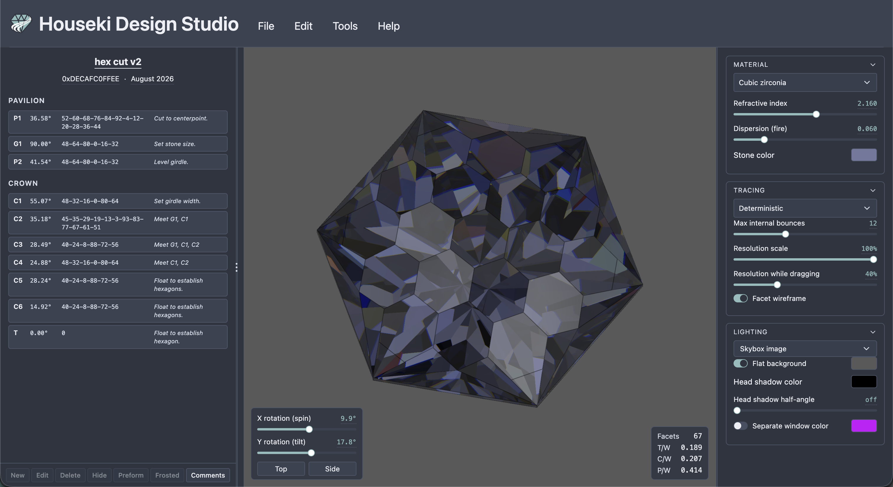
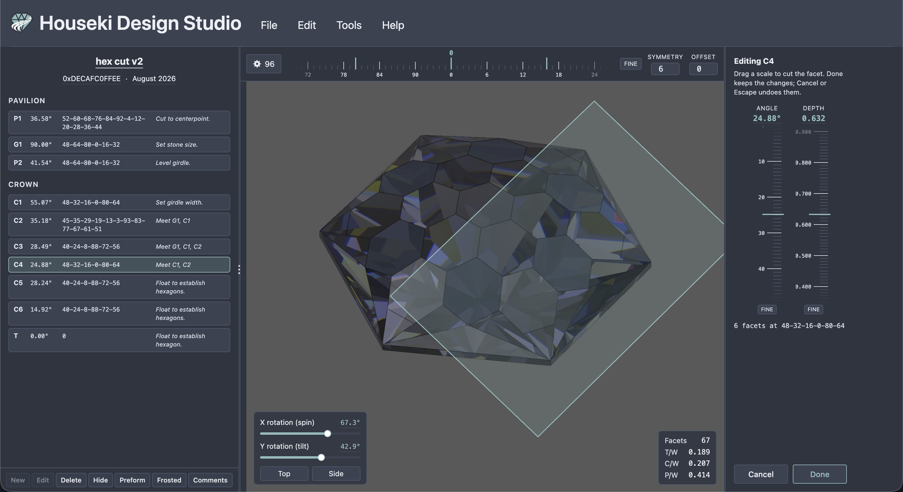
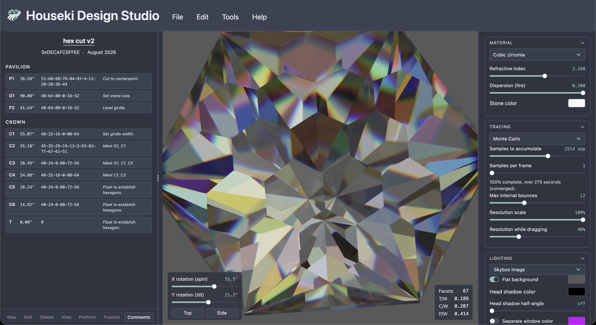

# Houseki Design Studio

**A gem cut designer and planner for faceters.**

Open a faceting design (`.gcs`, `.gem`, `.asc` or `.obj`) and see the stone
path-traced, with dispersion, beside its cutting instructions: every tier's angle, index-gear
teeth and notes, pavilion first, then crown, in the order you cut them. Click a tier to find its
facets on the stone.

It runs entirely in your web browser, with nothing to install.

Houseki is named after the manga *Houseki no Kuni* (land of the lustrous). Houseki Design Studio is written by Lucas Tong, based in Seattle.

## Screenshots

The startup stone, a hexagonal cut, in the quick deterministic preview, with its cutting
instructions on the left and the material, tracing and lighting settings on the right:

Editing a tier: the tier's cutting plane is drawn through the stone, and its angle and depth are
set by dragging the scales:

The same stone in the Monte Carlo path tracer, with the fire turned up and the samples
accumulated until the image converges:

Licensed Apache-2.0. See [`LICENSE`](LICENSE) and [`NOTICE`](NOTICE).
